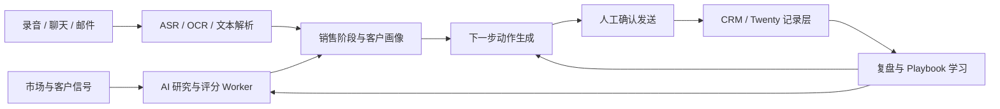

# AI 辅助销售工具可行性 Debate 总报告

日期：2026-06-10

## 结论先行

可以做，而且方向清楚：不要做“全自动 AI 销售机器人”，要做 **AI 销售推进 Copilot**。

最稳的产品形态是：把市场信号、客户资料、销售对话、销售内容、下一步动作和复盘沉淀接起来。AI 不直接替销售乱发消息、乱承诺、乱成交，而是在每个销售节点给出证据、话术、提醒、评分、复盘和训练。

一句话定位：

> 给销售团队用的 AI 销售推进助手：会前研究客户，会中提示话术，会后复盘录音/聊天，自动生成下一步跟进内容，并把客户阶段、风险、任务和学习沉淀进 CRM。

## 5 个小工的分工与裁决

### A. SEO / 内容增长视角

重点仓库：

- [oaker-io/wewrite](https://github.com/oaker-io/wewrite)
- [zubair-trabzada/geo-seo-claude](https://github.com/zubair-trabzada/geo-seo-claude)
- [AgriciDaniel/claude-seo](https://github.com/AgriciDaniel/claude-seo)
- [coreyhaines31/marketingskills](https://github.com/coreyhaines31/marketingskills)
- [ericosiu/ai-marketing-skills](https://github.com/ericosiu/ai-marketing-skills)

结论：

这些仓库说明，市场营销侧已经从“写内容”进化到“发现机会 -> 审计账号/网站 -> 生成证据 -> 触达 -> 复盘”的链条。尤其是 GEO/SEO 审计、内容质量评估、AI 搜索可见性、竞品页面、冷邮件、RevOps、销售赋能，都能变成销售推进素材。

可复用能力：

- 输入公司域名，生成客户公司研究、技术/内容/SEO/GEO 痛点。
- 生成“为什么现在找你”的触达理由。
- 输出个性化冷邮件、公众号文、朋友圈文、销售一页纸、异议处理卡。
- 将打开率、回复率、会议率、成单率回写成 playbook。

裁决：

营销内容不是终点。内容要服务销售阶段，例如“唤醒沉默客户”“推动试用转正式”“处理价格异议”“给老板汇报 ROI”。

### B. AI 销售代理 / 销售教练视角

重点仓库：

- [filip-michalsky/SalesGPT](https://github.com/filip-michalsky/SalesGPT)
- [zubair-trabzada/ai-sales-team-claude](https://github.com/zubair-trabzada/ai-sales-team-claude)
- [hanxiao199001/sales-ai-assistant](https://github.com/hanxiao199001/sales-ai-assistant)
- [feng-crazy/salemates](https://github.com/feng-crazy/salemates)
- [AlanBook/Sales-Champion-Cloud-Group](https://github.com/AlanBook/Sales-Champion-Cloud-Group)
- [iflykingc-oss/sales-ai-coach](https://github.com/iflykingc-oss/sales-ai-coach)
- [taonixiaoniao/SalesCrownAI](https://github.com/taonixiaoniao/SalesCrownAI)
- [juzhang-sama/SalesChampionAI](https://github.com/juzhang-sama/SalesChampionAI)
- [Aaronwn/ai-saler](https://github.com/Aaronwn/ai-saler)

结论：

销售侧最有价值的不是一个聊天框，而是覆盖 **会前研究、会中助攻、会后复盘、组织沉淀** 的销售操作系统。

可复用能力：

- SalesGPT：销售阶段识别、产品知识库、工具调用、预约/支付等成交动作。
- ai-sales-team-claude：客户研究、联系人识别、BANT/MEDDIC 资格评估、竞品情报、外联序列。
- 中文销冠项目：录音/聊天记录输入，产出客户画像、质检评分、跟进建议、管理驾驶舱、销冠话术沉淀。

裁决：

短期 MVP 不建议直接让 AI 自动与客户完成成交。更稳的是先做“销售参谋 + 教练 + 复盘”。自动成交只适合低客单价、强标准化、强授权的场景。

### C. CRM / 业务系统底座视角

重点仓库：

- [twentyhq/twenty](https://github.com/twentyhq/twenty)

结论：

Twenty 可以作为 CRM 底座候选。它是开源 CRM，定位是 Salesforce 的开放替代，并且强调可扩展、面向 AI。它适合承担客户主数据、商机、任务、时间线、权限、对象模型和系统记录。

建议用法：

- Twenty 做记录层：Companies、People、Opportunities、Tasks、Notes、Messages。
- 外部 AI worker 做智能层：研究、评分、摘要、话术、跟进建议、质检、训练。
- 通过 REST / GraphQL / Webhooks / Workflows / Apps 写回 CRM。

建议新增对象：

- Lead
- IntentSignal
- AccountResearchDossier
- LeadScoreSnapshot
- CallInsight
- CampaignEnrollment
- LifecycleEvent
- NextBestAction

裁决：

不要自己从零做 CRM。可以用 Twenty 或类似 CRM 做底座，再把 AI 做成 intelligence / action layer。这样产品边界更清楚，也更容易落地。

### D. 微信 / RPA / 私域触达视角

重点仓库：

- [aideluoflow/xm-bot4-rpa-helper](https://github.com/aideluoflow/xm-bot4-rpa-helper)
- [aideluo/xm-bot4](https://github.com/aideluo/xm-bot4)
- [xtbb2025/-wechatsdk](https://github.com/xtbb2025/-wechatsdk)
- [arould001/cui-hua-skill](https://github.com/arould001/cui-hua-skill)
- [aurora-03/ai-chat-assistant](https://github.com/aurora-03/ai-chat-assistant)
- [shangyankeji/zhixun](https://github.com/shangyankeji/zhixun)

结论：

微信私域确实有巨大需求：加粉、破冰、自动回复、朋友圈、群发、客户旅程、RAG 知识库、SCRM 集成。但高风险点也很明显：个人微信自动化、群控、多账号、防封、自动群发、拟真互动，容易触碰平台风控和合规边界。

可复用方向：

- 意图识别。
- 客户标签。
- RAG 知识库。
- 回复建议。
- 跟进任务。
- 人工接管。
- 销售复盘。
- 合规检测。
- 销售训练。

应避免方向：

- 批量加好友。
- 自动群发。
- 多账号群控。
- 绕过平台风控。
- AI 假扮真人强互动。
- 未经授权抓取或保存敏感聊天数据。

裁决：

做 **Copilot-first，不做 Bot-first**。让 AI 给销售建议、草拟、复盘、提醒、质检，由人确认发送。这个方向可持续，也更容易被正规销售团队接受。

### E. 产品经理 / 反方视角

结论：

反方核心提醒很重要：不要把“会生成内容”误判成“能推进销售”。如果没有客户阶段、下一步动作、触达反馈、销售复盘和 CRM 回写，产品只是营销内容工具，不是销售推进工具。

裁决：

反方有道理。最终产品必须围绕“推进”设计，而不是围绕“生成”设计。每一次 AI 输出都要绑定一个销售阶段、一个客户对象、一个动作建议、一个证据来源和一个反馈结果。

备注：

有一个小工额外提到了不在原始清单里的 `weclaw`、`clawhost`、`codex-imagegen`。最终裁决中已把这些作为范围外素材剔除，未作为主证据。

## 仓库意图地图

### 1. 内容获客与市场信号

代表仓库：

- `wewrite`
- `geo-seo-claude`
- `claude-seo`
- `marketingskills`
- `ai-marketing-skills`

用意：

帮助用户生产、优化、审计和分发市场内容，并通过 SEO/GEO/营销技能发现机会。

与销售推进的关系：

这些能力可以生成“触达理由”和“销售证据”。例如客户网站 AI 可见性差、竞品页面落后、内容过期、缺少 schema、品牌被竞品覆盖，都可以变成销售开场白。

### 2. 线索研究与外联策略

代表仓库：

- `ai-sales-team-claude`
- `marketingskills`
- `ai-marketing-skills`

用意：

把客户研究、联系人识别、资格评估、外联内容、会议准备拆成多个 agent / skill。

与销售推进的关系：

这是最直接可用的一簇能力。可以做成“输入公司 URL -> 输出客户档案、评分、联系人、痛点、外联序列、下一步动作”。

### 3. 销售对话代理

代表仓库：

- `SalesGPT`
- `ai-chat-assistant`
- `salemates`

用意：

让 AI 在对话中识别销售阶段、调用产品知识库、处理异议、安排会议甚至生成支付链接。

与销售推进的关系：

适合做“会中助手”。但生产环境要有人工接管、授权边界、审计日志和合规策略。

### 4. 销冠教练与销售复盘

代表仓库：

- `sales-ai-assistant`
- `sales-ai-coach`
- `Sales-Champion-Cloud-Group`
- `cui-hua-skill`
- `zhixun`

用意：

把真实销售能力、录音、聊天记录、行业话术和管理指标沉淀成训练系统。

与销售推进的关系：

这是最适合作为 MVP 的低风险路径。录音/聊天记录上传后，AI 可以给出客户画像、销售阶段、异议点、未问问题、风险提醒、跟进建议和教练评分。

### 5. CRM / 流程底座

代表仓库：

- `twenty`

用意：

提供开源 CRM 基础设施，承载客户、联系人、商机、任务、活动和自定义对象。

与销售推进的关系：

CRM 是闭环的账本。没有 CRM 或类似记录层，AI 很难持续学习，也无法证明自己真的推进了销售。

### 6. 微信私域 / RPA 自动化

代表仓库：

- `xm-bot4-rpa-helper`
- `xm-bot4`
- `-wechatsdk`

用意：

围绕微信私域、工作手机、RPA、AI 员工做触达自动化。

与销售推进的关系：

需求真实，但风险也最高。更适合作为“人工确认的回复建议、标签、任务、复盘”参考，不适合直接做自动群控。

## 推荐产品形态

产品名可以先叫：

> SalesPilot AI：销售推进 Copilot

核心用户：

- 有 5-100 人销售团队的 B2B 公司。
- 私域成交团队，例如教育、汽车、房产、本地服务、医美、招商加盟。
- SEO/GEO/营销代理商，用于客户审计、线索生成和销售提案。
- 创始人销售团队，用于自动研究客户、准备会议、生成外联和复盘。

核心价值：

- 销售少花时间查客户、写跟进、整理纪要。
- 管理者看见销售过程质量，而不是只看结果。
- 团队把销冠经验沉淀为可训练、可复用、可审计的 playbook。
- AI 每次建议都有证据来源、销售阶段和下一步动作。

## MVP 建议

### MVP 1：销售复盘与跟进助手

这是最建议先做的版本。

输入：

- 销售录音。
- 微信/企微/邮件聊天截图或文本。
- 客户公司名称/URL。
- 产品知识库。

输出：

- 客户画像。
- 当前销售阶段。
- BANT / MEDDIC 简版评分。
- 客户痛点和购买障碍。
- 销售遗漏问题。
- 异议处理建议。
- 下一步跟进话术。
- 给主管看的销售质检报告。
- CRM 任务和商机字段更新建议。

为什么先做它：

- 不依赖高风险自动群发。
- 销售愿意用，因为能省时间。
- 管理者愿意买，因为能看见过程质量。
- 数据能沉淀，后续可以训练行业 playbook。

### MVP 2：客户研究与外联生成器

输入：

- 目标公司 URL。
- 目标行业。
- 自家产品定位。
- ICP。

输出：

- 公司研究卡片。
- SEO/GEO/内容/竞品触发点。
- 决策人角色推断。
- 线索评分。
- 冷邮件/私信/电话开场白。
- 会议准备 brief。
- 销售提案大纲。

为什么适合第二步：

它能服务获客，但不直接碰高风险自动发送。先做“生成和建议”，再做人审发送。

### MVP 3：CRM Copilot

基于 Twenty 或现有 CRM。

能力：

- 自动总结客户时间线。
- 从聊天/录音中提取任务。
- 更新商机阶段建议。
- 提醒超时未跟进。
- 输出下一步最佳动作。
- 把赢单/丢单原因写回知识库。

为什么放第三步：

CRM 集成通常工程量较大，但一旦接上，产品从“单点工具”变成“销售系统”。

## 推荐系统架构

模块拆分：

- 数据输入层：网站、CRM、聊天记录、录音、邮件、表单、日历。
- 解析层：ASR、OCR、网页抓取、结构化抽取。
- 智能层：客户研究、评分、销售阶段判断、异议识别、话术生成。
- 人审动作层：外联、跟进、会议准备、提案、任务创建。
- 记录层：CRM、任务、商机、客户时间线、审计日志。
- 学习层：赢单/丢单、回复率、会议率、质检分、销冠话术库。

## 最重要的产品原则

1. 每条建议都要绑定证据。

例如“建议跟进价格异议”，必须指出来自哪句聊天、哪段录音或哪个网页信号。

2. 每次输出都要绑定销售阶段。

不同阶段的话术不同。早期是发现痛点，中期是建立价值，后期是处理风险和推动决策。

3. 默认人工确认。

尤其是微信、短信、邮件、报价、承诺、付款链接，必须有人确认。

4. CRM 是账本。

AI 生成不算推进，只有客户阶段、任务、回复、会议、商机金额、赢单/丢单被记录，才算推进。

5. 销冠经验要结构化。

真正壁垒不是“模型会聊天”，而是行业销售 SOP、异议库、客户画像、质检规则和复盘数据。

## 不建议做的方向

- 不建议做通用 AI CRM，从零替代 Salesforce / HubSpot / Twenty。
- 不建议做个人微信群控机器人。
- 不建议把自动群发、自动加粉、防封规避作为核心卖点。
- 不建议做“AI 自动成交”作为首版主功能。
- 不建议只做冷邮件生成器，门槛太低。
- 不建议只做内容生成器，容易停在营销工具，不是真销售工具。
- 不建议把 GEO/SEO 分数包装成绝对准确的成交预测。

## 可以形成差异化的壁垒

1. 行业化销售 playbook。

例如汽车、房产、教育、企业服务、医美、招商。每个行业都有不同客户心理、异议、成交节点和合规边界。

2. 对话复盘数据。

大量真实对话比公开网页更有价值。把它变成质检、训练和下一步动作，是护城河。

3. CRM 闭环。

知道建议是否被采纳、客户是否回复、商机是否推进，AI 才能越用越准。

4. 人工确认 + 合规审计。

这不是产品弱点，而是进入企业客户的前提。

5. 从营销信号到销售动作的连接。

多数工具停在内容或 CRM。真正有价值的是把“客户发生了什么”翻译成“销售今天该做什么”。

## 最终建议

如果要启动，我建议按这个路线：

第一阶段，做“销售复盘与跟进助手”：

- 支持上传录音/聊天记录。
- 识别客户画像、销售阶段、异议、风险。
- 生成下一步跟进话术和 CRM 任务。
- 输出主管质检报告。

第二阶段，做“客户研究与个性化外联”：

- 输入公司 URL。
- 生成客户档案、痛点、SEO/GEO/竞品触发点。
- 生成邮件、微信、电话开场白和会议 brief。

第三阶段，接 CRM：

- 优先基于 Twenty 或现有 CRM。
- 写回客户、商机、任务、时间线、评分、复盘。
- 建立团队级 playbook。

第四阶段，做受控自动化：

- 邮件/企微/微信只做草稿和建议。
- 高权限动作需要人工确认。
- 可以在低风险渠道做自动提醒、自动总结、自动建任务。

最终产品不是“AI 替你销售”，而是：

> AI 帮销售更快理解客户，更准判断阶段，更会说下一句话，更少漏跟进，并把每次销售过程变成团队资产。

这条路能做，而且比“自动发消息机器人”更稳、更长期、更像一个真正能卖给企业的产品。

