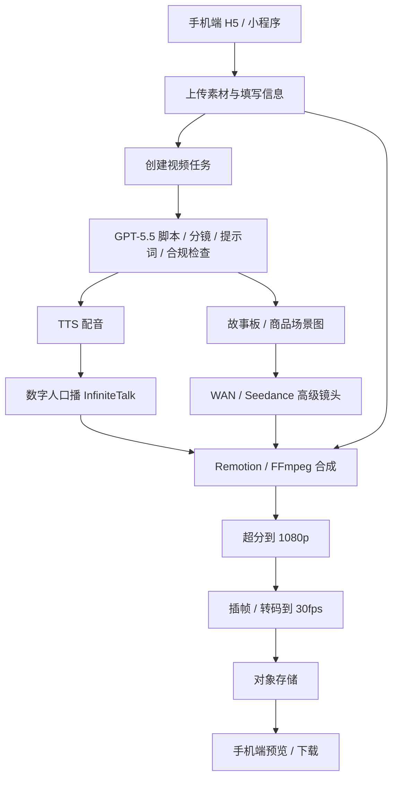

# 技术架构

## 总体架构

推荐形态：

```text
手机端入口 + 云端任务队列 + 云端模型/API + 云端存储 + 后处理 worker
```

手机端负责：

- 拍照。
- 上传图片 / 视频 / 评价截图。
- 填写商品名、价格、卖点、店铺信息。
- 选择模板、视频时长、风格。
- 预览脚本。
- 查看生成进度。
- 下载成片。
- 复制标题、话题、发布文案。

云端负责：

- GPT-5.5 脚本、分镜、提示词。
- TTS 配音。
- 数字人 / 口播。
- WAN / Seedance 高级镜头。
- 字幕。
- FFmpeg / Remotion 合成。
- 1080p 超分。
- 30fps 插帧 / 转码。
- 存储和下载。

## 参考链路



## 模块分层

### 业务后端

建议：

- Node.js / FastAPI 均可。
- 负责用户、订单、套餐、额度、任务状态、素材记录。
- 不直接执行耗时生成任务。

核心表：

- users
- subscriptions
- credits
- assets
- video_jobs
- job_steps
- renders
- audit_logs

### 任务队列

建议：

- Redis + BullMQ。
- 或 Redis + Celery。
- 更复杂时再考虑 Temporal。

任务拆分：

```text
script_generation
tts_generation
storyboard_generation
digital_human_generation
ai_shot_generation
render_composition
upscale
frame_interpolation
final_export
```

这样某个镜头失败时，只重试局部，不重做整条视频。

### CPU Worker

负责：

- 字幕生成和排版。
- 图片裁剪、缩放、调色。
- 模板合成。
- FFmpeg 转码。
- Remotion 渲染。
- 封面图导出。

这部分成本低，适合大量跑。

### GPU / API Worker

负责：

- WAN I2V/T2V。
- Seedance 高级镜头。
- InfiniteTalk 数字人口播。
- 超分。
- 插帧。
- 复杂图像生成。

第一版建议优先调用现成 API，不要一开始自建。

## 手机端选择

阶段建议：

| 阶段 | 入口 | 理由 |
|---|---|---|
| MVP | 移动端 H5 / PWA | 最快上线，适合验证 |
| Beta | 微信小程序 | 小店主熟悉，便于微信内转化 |
| 成熟期 | 原生 App / 抖音小程序 | 等需求稳定后再做 |

第一版手机端页面：

- 工作台。
- 创建视频。
- 上传素材。
- 填写信息。
- 脚本确认。
- 生成进度。
- 成片预览。
- 下载与发布辅助。

## 1080p30 策略

不要强行要求所有模型原生 1080p30。

更合理：

```text
模型输出 720p / 1080p，通常 24fps 左右
  -> 后处理超分到 1080p
  -> RIFE / 其他插帧到 30fps
  -> H.264 / H.265 导出
```

默认：

- 普通套餐：720p 生成后超分到 1080p30。
- 中高套餐：部分镜头原生 1080p。
- 高级加购：Seedance / 更高级模型。

## 客户电脑和本地 GPU

客户电脑不参与计算。

本地 GPU 可以用于：

- 研发测试。
- 工作流调参。
- 夜间低优先级任务。
- 早期小批量样片。

但正式产品应按云端架构设计：

```text
用户提交任务 -> 云端队列 -> 本地 worker 或云 worker 接单 -> 统一回传云端存储
```

这样未来扩容不用重构。

